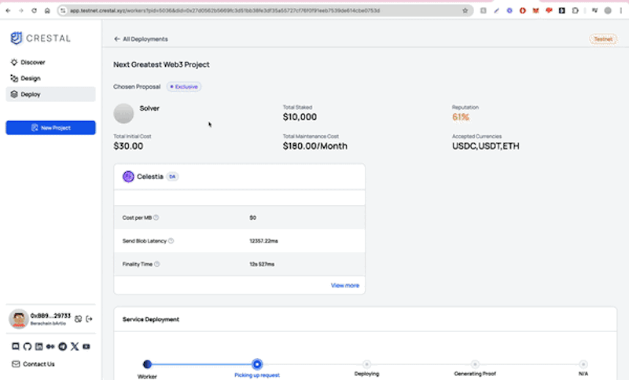

## Step 1: Get Your Avail Node with Crestal

**Crestal** provides the Avail node for you, so you don’t need to set it up from scratch. 
This node is essential for your rollup because it guarantees that all transaction data is properly stored and easily accessible. This Data Availability (DA) is critical for rollups to verify and confirm transactions.

Here’s a short summary of how to get a deployed node using the Crestal Carbon testnet:

1. Connect to Crestal: Visit the **[Crestal Carbon Testnet](https://app.testnet.crestal.xyz/dashboard)** and connect your EVM-compatible wallet.
2. Get Test Tokens: Obtain testnet tokens from the Polygon Amoy or Berachain Bartio faucet.
3. Use the AI Design Assistant: Define your infrastructure needs, such as DA services and execution stacks, with Crestal's AI.
4. Submit to the Marketplace: Submit your design to the Crestal Intent-Based Marketplace for solver proposals.
5. Deploy Node: Once a proposal is selected, Crestal will handle the deployment, and you’ll receive the necessary node parameters for integration.

Please follow [this guide](/guides/testnet) for more detailed steps on how to get your own node.

After the node is deployed, the node details will look like the ones bellow. The **WSS URL** will be needed to start the server on the next step,
as it allows your rollup to communicate securely and in real-time with the Data Availability layer provided by Crestal’s Avail node


```json
{
"token": "bea08b5e5ad9938ccd5be3a6379c294dbac724e772c58e9c2e2165ceb92218c0",
"access_url": "https://avail-turing.service.testnet.crestal.xyz/bea08b5e5ad9938ccd5be3a6379c294dbac724e772c58e9c2e2165ceb92218c0",
"server_https_url": "https://avail-turing.service.testnet.crestal.xyz",
"server_web_socket_url": "wss://avail-turing.service.testnet.crestal.xyz"
}
```

## Step 2: Set Up Your Avail Alt DA Server

Before we even touch the OP Stack, we need to get the Avail Alt DA server up and running. This server is the key connection point to Avail’s Data Availability (DA) layer, which Crestal provides for you. Let’s set this up first.

### 2.1 Create a New Wallet for Avail DA and Get Test Tokens

If you don’t have a wallet for Avail DA yet, no worries—we’ll get you started right here.

- **Install a Wallet Extension:** We recommend [Subwallet](https://www.subwallet.app/download.html) to manage your Avail account.
- **Create a New Wallet:** Open the wallet extension and create a new account. Make sure to save that seed phrase somewhere safe.
  - Example Avail Address: `5E1qtvznhpcCoPzigNFqS5sqMHxo1VTXmX4YSR9yqCiqWrEg`
- **Get Avail Test Tokens:** Go to the [Avail Faucet](https://faucet.avail.tools/) and paste your new address to get some test tokens.
- **Verify Your Tokens:** Head over to the [Avail Explorer](https://explorer.avail.so), make sure your wallet is connected, and confirm you’ve received the test tokens.

### 2.2 Generate Your Own Avail DA App ID

Next, let’s register your app on Avail DA using an App ID. This ID is like your app’s unique identifier when interacting with the DA layer.

- **Go to the Chainstate Explorer:** Visit [Avail explorer](https://explorer.avail.so/#/chainstate), uncheck the "Include Option" toggle, and click the "+" next to the method name to fetch all registered App IDs.
- **Register Your Own App ID:** Follow the [official guide](https://docs.availproject.org/docs/end-user-guide/app-id#how-to-register-my-own-appid) to create an App ID for your app.
  - Example App ID:
    - **owner:** `5E1qtvznhpcCoPzigNFqS5sqMHxo1VTXmX4YSR9yqCiqWrEg`
    - **id:** `135`

### 2.3 Set Up the Avail Alt DA Server with Crestal's node

This server will handle all of your rollup’s data availability. You will need the Avail node provided by Crestal at (step 1)[#step-1-get-your-avail-node-with-crestal]for this.

- **Clone the Server Repository:** 
```bash
 git clone https://github.com/availproject/avail-alt-da-server.git 
 ```

- **Start the Server:** 

Firstly, make sure you have the WSS URL for your node. You can always find the node details by navigating to
the **Deploy** section on the **[Crestal Carbon Testnet](https://app.testnet.crestal.xyz/dashboard)**, select
your project, and click on **View Details** at the bottom-right corner of the page.



Then navigate to the `avail-alt-da-server` directory and run the following command:

  ```bash
  ./bin/avail-da-server --addr=localhost --port=8000 \
    --avail.rpc=wss://avail-turing.service.testnet.crestal.xyz/bea08b5e5ad9938ccd5be3a6379c294dbac724e772c58e9c2e2165ceb92218c0 \
    --avail.seed="YOUR_WALLET_SEED_PHRASE_HERE" \
    --avail.appid=135
  ```

  Here’s a breakdown of the command:
  - `--addr=localhost --port=8000`: Runs the server locally on port 8000.
  - `--avail.rpc`: This is the WSS URL of the Avail node provided by Crestal.
  - `--avail.seed`: Use your wallet’s seed phrase here.
  - `--avail.appid=135`: Replace `135` with your own App ID.

### 2.4 Verify the DA Server is Running

After starting the DA server, you should see logs confirming that it’s connected to the Avail network:

```text
INFO [10-17|22:59:06.934] Initializing Alt DA DA server...
INFO [10-17|22:59:06.935] Connecting to wss://avail-turing.service.testnet.crestal.xyz/...
INFO [10-17|22:59:09.534] Started DA Server
```

## Step 3: Create an Infura Account for the Ethereum Sepolia Node

Now that the DA server is running, you’ll need an Infura account to interact with Ethereum’s Sepolia testnet.

1. **Sign Up for Infura:** Go to [Infura](https://infura.io) and sign up for a free account.
2. **Create a New Project:** Select Sepolia as the network.
3. **Note Project Details:** Note down the Project ID and API Key—you’ll need these to connect your rollup to Sepolia.

Your Sepolia node URL will look like this:

```
https://sepolia.infura.io/v3/your-infura-project-id
```

## Step 4: Building the Optimism Adapter Source

Now that the DA server is running, let’s build the adapter source for Optimism. Clone the Optimism repo and build the required components.

```bash
git clone https://github.com/ethereum-optimism/optimism.git
cd optimism
git fetch --tag --all
git checkout v1.9.1
git submodule update --init --recursive
pnpm install
make op-node op-batcher op-proposer
make build
```

With these commands, you’ll have the OP stack components (node, batcher, proposer) ready to go for your rollup.

## Step 5: Building Geth

This will help with syncing your rollup chain.

```bash
git clone https://github.com/ethereum-optimism/op-geth.git
cd op-geth
git fetch --tag --all
git checkout v1.101408.0
make geth
```

If you’re using brew to install Go, you’ll want to update the `GORUN` variable in the Makefile:

```
GORUN = /opt/homebrew/opt/go@1.22/bin/go run
```

This ensures your Go environment is properly set up.

## Step 6: Generating and Securing Keys

Generate the keys for your rollup roles: Admin, Proposer, Batcher, and Sequencer.

```bash
cd packages/contracts-bedrock
echo "Admin:"; cast wallet new
echo "Proposer:"; cast wallet new
echo "Batcher:"; cast wallet new
echo "Sequencer:"; cast wallet new
```

Example output for the Admin key:

```
Address: 0x879b4D04927304A3D383fC4F7b6Fe139053660dA
Private key: 0x9ef007ab575cd12aaeac661fb6f2c7b36a33a7e6a174f3f038015b76e58063bd
```

Make sure to save all the keys somewhere safe.

## Step 7: Network Configuration and Setup

After building the necessary repositories, the next step is to configure your chain settings. Create a `.envrc` file and add these variables:

```bash
# Admin account
export GS_ADMIN_ADDRESS=0xF5E8ce0C00F09Dd70Da27D0e9705E37A56c0d99F
export GS_ADMIN_PRIVATE_KEY=0x929de22a260c8ad100a054b2caf4e5f95f16c13cb5489a7b69f5c96caf1c9205

# Batcher account
export GS_BATCHER_ADDRESS=0x0b31383D636a965878E144b92Da1559d27D26b10
export GS_BATCHER_PRIVATE_KEY=0x292fb38aaa0ffc6e45494242406270e2f90827da170b27657e0df1edd888d211

# Proposer account
export GS_PROPOSER_ADDRESS=0x7Eca23cA2800A3F3D04232d6DA9F091e892C7D1F
export GS_PROPOSER_PRIVATE_KEY=0x0380b7e2b073bc8ce0a070d10b8d5e4a910514b43be2678d3b1c83d21a67f8a8

# Sequencer account
export GS_SEQUENCER_ADDRESS=0x40D1B9CC808Fd2142Ec995dE199879e84fD684DE
export GS_SEQUENCER_PRIVATE_KEY=0x67bdf03337224ccd1aaaa325a1ae407252fd551058e55188a5c7cfbcf8f18cbd

# L1 chain information
export L1_CHAIN_ID=11155111
export L1_BLOCK_TIME=12

# L2 chain information
export L2_CHAIN_ID=42069
export L2_BLOCK_TIME=2
export L1_RPC_KIND=infura

export L1_RPC_URL=wss://sepolia.infura.io/ws/v3/e4603e373f8a4a828a3b9b000f632a78
```

Activate the environment:

```bash
direnv allow .
```

## Step 8: Deploying Contracts

### 8.1 Generate Deployment Config

Head over to the `packages/contracts-bedrock` directory and run:

```bash
./scripts/getting-started/config.sh
```

This generates a file called `getting_started.json` in the `deploy-config` folder.

### 8.2 Update the Configuration

Open the `getting_started.json` file and add this at the bottom:

```json
{
  "useAltDA": true,
  "daCommitmentType": "GenericCommitment",
  "daChallengeWindow": 160,
  "daResolveWindow": 160,
  "daBondSize": 1000000,
  "daResolverRefundPercentage": 0
}
```

### 8.3 Deploy Your Contracts

Run the following command in the `packages/contracts-bedrock` directory:

```bash
DEPLOYMENT_OUTFILE=deployments/artifact.json \
DEPLOY_CONFIG_PATH=deploy-config/getting-started.json \
forge script scripts/deploy/Deploy.s.sol:Deploy --broadcast --private-key $GS_ADMIN_PRIVATE_KEY --rpc-url $L1_RPC_URL --slow
```

## Step 9: Running the Rollup Components

### 9.1 Run Geth

```bash
cd ~/Desktop/op-geth
mkdir datadir
build/bin/geth init --datadir=datadir --state.scheme=hash genesis.json
./build/bin/geth \
  --datadir ./datadir \
  --http \
  --http.corsdomain="*" \
  --http.vhosts="*" \
  --http.addr=0.0.0.0 \
  --http.port=9545 \
  --http.api=web3,debug,eth,txpool,net,engine \
  --ws \
  --ws.addr=0.0.0.0 \
  --ws.port=9546 \
  --ws.origins="*" \
  --ws.api=debug,eth,txpool,net,engine \
  --syncmode=full \
  --nodiscover \
  --maxpeers=0 \
  --networkid=42069 \
  --authrpc.vhosts="*" \
  --authrpc.addr=0.0.0.0 \
  --authrpc.port=9551 \
  --authrpc.jwtsecret=./jwt.txt \
  --rollup.disabletxpoolgossip=true \
  --state.scheme=hash \
  --cache=2048
```

### 9.2 Run the OP Node

```bash
cd ~/Desktop/optimism/op-node
./bin/op-node \
  --l2=http://localhost:9551 \
  --l2.jwt-secret=./jwt.txt \
  --sequencer.enabled \
  --sequencer.l1-confs=5 \
  --verifier.l1-confs=4 \
  --rollup.config=./rollup.json \
  --rpc.addr=0.0.0.0 \
  --rpc.port=8547 \
  --p2p.disable \
  --rpc.enable-admin \
  --l1=$L1_RPC_URL \
  --altda.enabled=true \
  --altda.da-server=http://localhost:8000
```

### 9.3 Run the OP Batcher

```bash
cd ~/Desktop/optimism/op-batcher
./bin/op-batcher \
  --l2-eth-rpc=http://localhost:9545 \
  --rollup-rpc=http://localhost:8547 \
  --poll-interval=1s \
  --private-key=$GS_BATCHER_PRIVATE_KEY \
  --altda.enabled=true \
  --altda.da-server=http://localhost:8000
```

### 9.4 Run the OP Proposer

Grab the `L2OutputOracleProxy` address from your `[chain-id]-deploy.json` file, located at `packages/contracts-bedrock/deployments`.


Now run the OP Proposer:

```bash
cd ~/Desktop/optimism/op-proposer
./bin/op-proposer \
  --rollup-rpc=http://localhost:8547 \
  --l2oo-address=0xb7236d31C0819DA796AD106e0A85922F20Dd5b53 \
  --private-key=$GS_PROPOSER_PRIVATE_KEY \
  --l1-eth-rpc=$L1_RPC_URL
```

## Step 10: Adding Your Rollup Network to the Wallet

Finally, add your custom rollup to a wallet like MetaMask and start playing with your new network!


