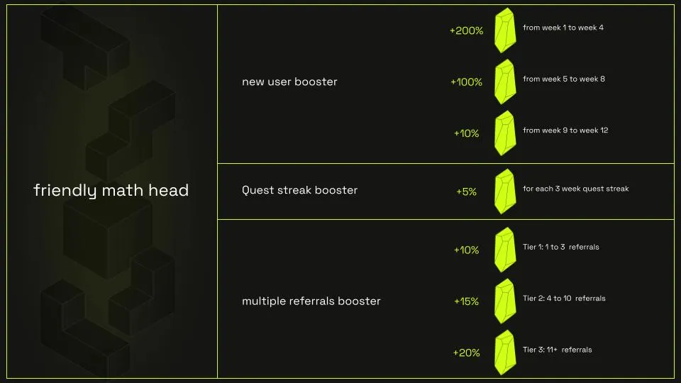
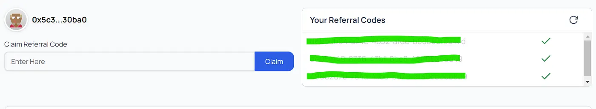
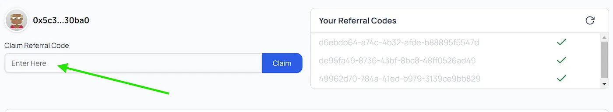
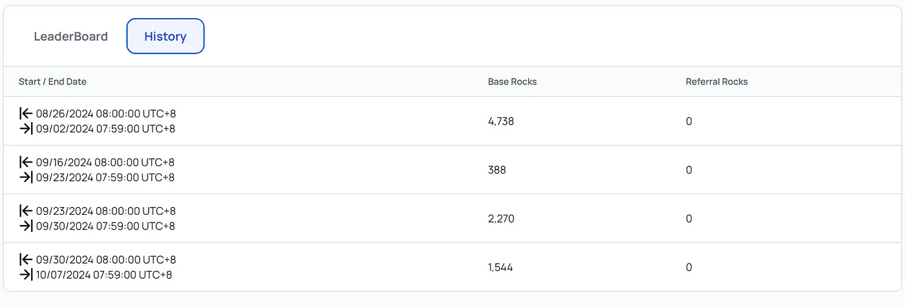

The Crestal referral program enables users to unlock referral codes by completing quests on the Crestal dApp. These codes can be shared with friends to earn **Rock Boosters**, which increase rewards for both referrers and referred friends.

## How It Works

### 1. Earn Referral Codes
- Complete quests on the Crestal dApp to unlock referral codes.
- If you have used Crestal Carbon before, you will receive 5 referral codes visible under your profile.

### 2. Share Referral Codes
- Share your referral codes with friends.
- Friends can claim and use the code to join the platform and start completing quests.

### 3. Earn Rock Boosters
- As your friends complete quests using your referral code, both you and your friends earn **Rock Boosters** based on quest completion and streaks.

## Referral Benefits

- **Up to 3x Rock Boost**: During the first 4 weeks, both referrers and referred friends can earn up to a 3x Rock Boost.
- **Tier-Based Scaling**: Increase your referrer tier by inviting more friends:
  - **Tier 1**: 1-3 friends = 10% Rock Booster.
  - **Tier 2**: 4-10 friends = 15% Rock Booster.
  - **Tier 3**: 11+ friends = 20% Rock Booster.
- **Quest Streak Rewards**: Earn a 5% Rock Boost each time your friends complete a 3-week quest streak. This booster stacks with every additional streak.

## Getting Started

If you have used Crestal Carbon in the past, you will automatically receive 5 referral codes. These codes are available under your profile.

If you need a referral code, you can claim one from a friend.

## Maximizing Your Rewards

### New User Booster
New users receive a quest multiplier during their first 12 weeks on Crestal Carbon:

- **Weeks 1-4**: Each quest your friend completes counts as 3 quests for both of you.
- **Weeks 5-8**: Each quest counts as 2 quests.
- **Weeks 9-12**: Each quest counts as 1.1 quests.

<Callout title="Quest Streak Booster">
Consistency is rewarded! If your friend completes one quest per week for 3 consecutive weeks, you'll receive a 5% Rock Booster. This booster stacks for every additional 3-week streak.
</Callout>

### Multiple Referrals Booster
Unlock more potential as you refer additional friends! Each week, you have the opportunity to earn new referral codes. Use them wisely to scale your referrer tier and unlock bigger rewards:

- **Tier 1**: 1–3 friends referred = 10% Rock Booster.
- **Tier 2**: 4–10 friends referred = 15% Rock Booster.
- **Tier 3**: 11+ friends referred = 20% Rock Booster.

## Tracking Your Referrals
You can easily track your referral activity in the new **History** tab under your profile. This section provides:

- Your weekly Rock collection.
- The number of Rocks you’re earning from your referrals.

