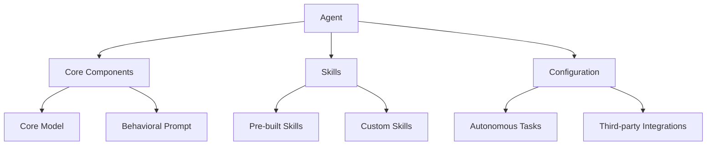
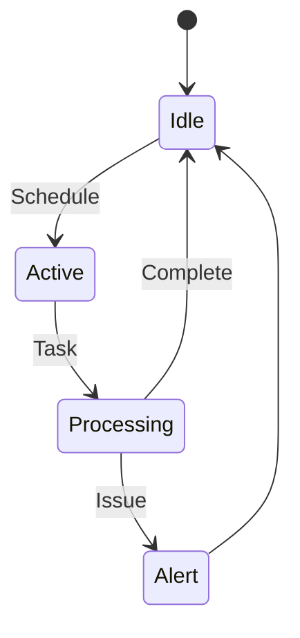

# Understanding Agents

IntentKit agents are AI assistants that can be customized with specific roles and behaviors. Each agent can be configured to handle different tasks autonomously.



## Creating Agents

Basic agent creation:

```bash
curl -X POST http://127.0.0.1:8000/agents \
     -H "Content-Type: application/json" \
     -d '{
         "id": "test-bot",
         "name": "Test Bot",
         "model": "gpt-4",
         "prompt": "You are a helpful AI assistant."
     }'
```

## Quick Testing

Test your agent:

```bash
# Basic chat test
curl "http://127.0.0.1:8000/agents/test-bot/chat?q=Hello"

# Browser testing
http://127.0.0.1:8000/agents/test-bot/chat?q=Hello
```

## Agent Configuration

```json
{
  "id": "trading-bot",
  "name": "Trading Assistant",
  "model": "gpt-4",
  "prompt": "You are a crypto trading assistant with expertise in market analysis.",
  "autonomous_enabled": false,
  "autonomous_minutes": null,
  "autonomous_prompt": null,
  "integrations": {
    "cdp": true,
    "twitter": false
  }
}
```

### Core Settings
- `id`: Unique identifier
- `name`: Display name
- `model`: AI model selection
- `prompt`: Base instructions

### Autonomous Mode



Enable autonomous execution:

```json
{
  "autonomous_enabled": true,
  "autonomous_minutes": 60,
  "autonomous_prompt": "1. Monitor market conditions
2. Alert on significant changes
3. Execute predefined strategies"
}
```

## Adding Skills

Agents can use various skills. See [Skills Guide](/intentkit/skills-guide) for details.

```json
{
  "skills": {
    "built_in": ["market_analysis", "risk_management"],
    "custom": ["my_trading_strategy"]
  }
}
```

## Quotas

Monitor usage via headers:
```
X-RateLimit-Remaining: 985
X-RateLimit-Reset: 3600
```

## Error Handling

Common status codes:
- `404`: Agent not found
- `429`: Quota exceeded
- `500`: Internal error

Error format:
```json
{
  "error": {
    "code": "quota_exceeded",
    "message": "Daily limit reached",
    "reset_time": "2024-01-01T00:00:00Z"
  }
}
```

## Best Practices

1. **Agent Design**
   - Clear, specific prompts
   - Focused responsibility
   - Appropriate skills

2. **Configuration**
   - Test manually first
   - Start simple
   - Monitor performance

3. **Production Use**
   - Implement rate limiting
   - Monitor quotas
   - Regular log reviews