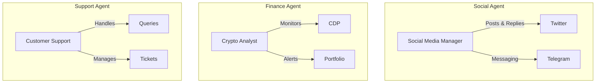
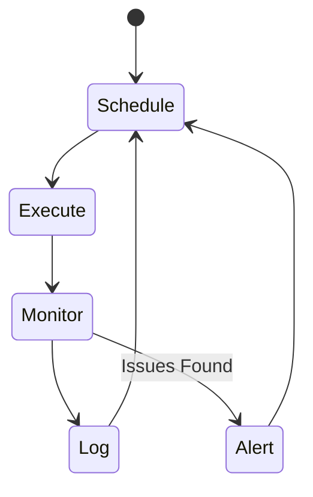
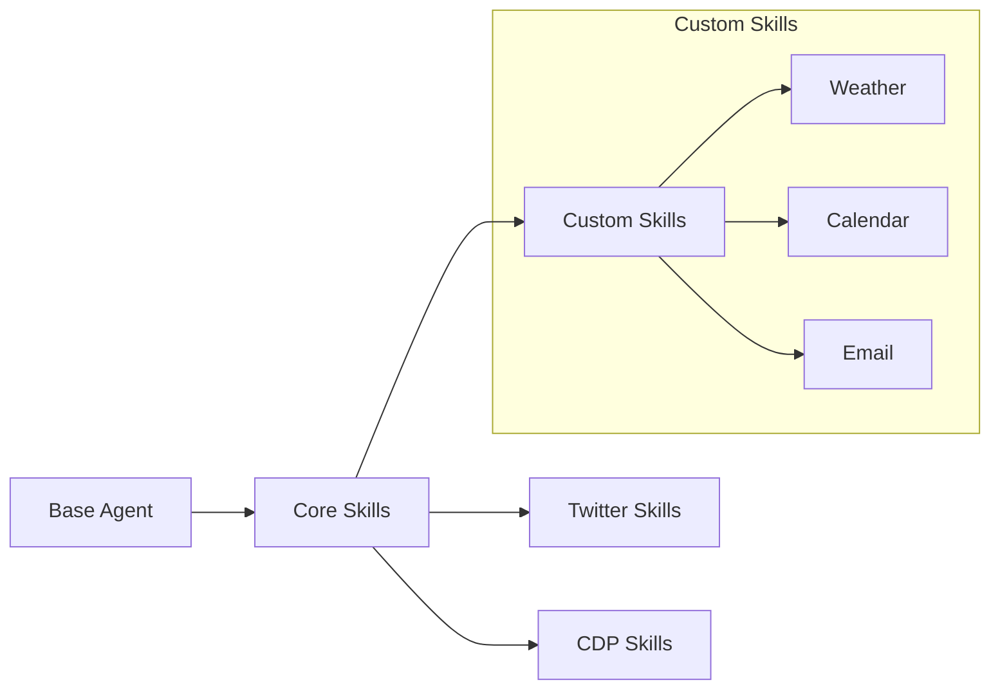
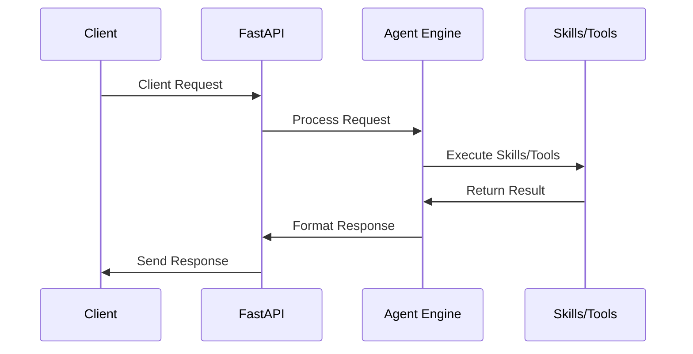
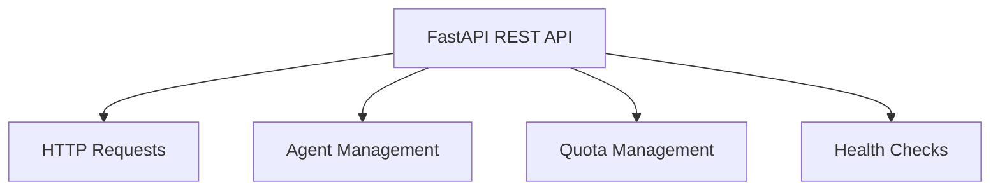
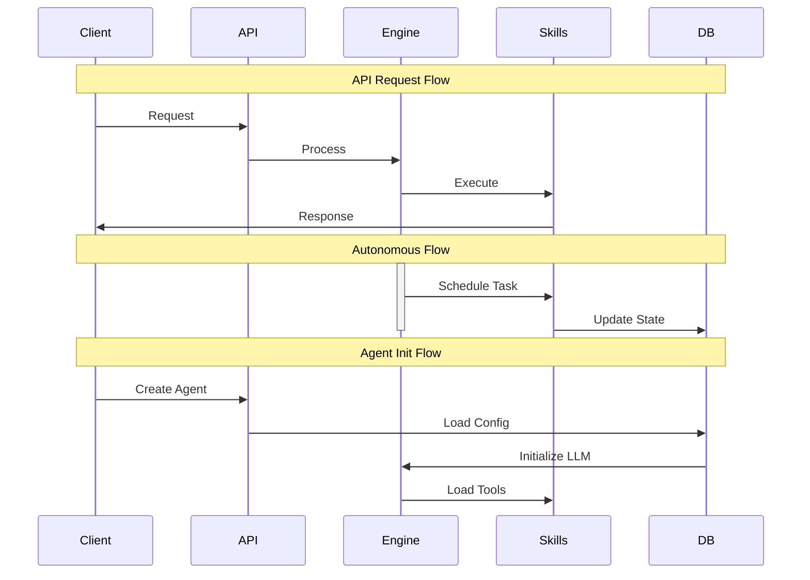

<Info>**Currently in alpha stage. Not recommended for production use.**</Info>

# What is IntentKit?

Imagine you have a helpful robot friend. This robot can do many things for you:
- Talk to people on social media
- Keep track of your digital money
- Learn new tricks that you teach it
- Work by itself when you're busy

IntentKit helps you create and train these robot friends. Think of it like a workshop where you can build different robots for different jobs.

## Features:

### 🤖 Multiple Agent Support

Create different AI agents for specific tasks - like having a social media manager, a crypto analyst, and a customer support agent all working together.



### 🔄 Autonomous Agent Management

Your agents can work independently on scheduled tasks. Set them up once, and they'll handle repetitive work automatically.



### 🔗 Blockchain Integration (CDP)

Connect with Coinbase Developer Platform to monitor crypto prices, track portfolios, and manage digital assets.

### 🐦 Social Media Integration

Agents can manage Twitter and Telegram accounts - posting updates, responding to messages, and monitoring mentions.

### 🛠️ Extensible Skill System

Teach your agents new tricks by creating custom skills. Add any capability you need.



### 🔌 Plugin System

Easily add new platforms and tools without changing the core system.

## Architecture

IntentKit uses a modular architecture with distinct components:

```python
# Core Stack
fastapi     # API Layer
langchain   # Agent Engine
postgresql  # Database
pydantic    # Validation
```

### Component Overview

**1. Main System Components**



This sequence diagram illustrates how a typical request flows through the system:

- The Client sends a request to the FastAPI layer.
- FastAPI processes the request and forwards it to the Agent Engine (responsible for processing the business logic).
- The Agent Engine calls Skills/Tools to perform the necessary task (e.g., external API interaction or complex computation).
- Once the task is completed, Skills/Tools returns the result to the Agent Engine.
- The Agent Engine formats the response and sends it back to FastAPI.
- Finally, FastAPI sends the formatted response to the Client.


**2. FastAPI Layer Functions:**



This diagram represents the functions provided by the FastAPI layer:

- Requests: Handles incoming HTTP requests from the client.
- Agent Management: Manages the creation, configuration, and lifecycle of AI agents.
- Quota Management: Ensures that the usage of resources, such as API calls, is within predefined limits to avoid overuse.
- Health Checks: Monitors the health of the system and ensures everything is working as expected.

___

### Data Flows



This diagram shows three key flows in the system:

**API Request Flow**

The request comes from the Client, is processed by FastAPI, and passed to the Agent Engine. The Engine then calls Skills to perform the necessary tasks, which in turn returns the result to the client.

**Autonomous Flow**

In the autonomous flow, the Agent Engine schedules tasks that are handled by Skills. Once the task is completed, Skills updates the Database (DB) with the relevant state, and the engine becomes inactive until the next task is scheduled.

**Agent Initialization Flow**

When a new Agent is created by the Client, FastAPI loads the configuration from the Database, initializes the Agent Engine, and then loads the required tools or skills.
___

### Key Features

1. **Caching System**
```python
# Agent caching for performance
agents = {
    'id': AgentInstance,
    'invalidate_at': timestamp
}
```

2. **Tool Management**
```python
# Dynamic skill loading
def load_tools(config: AgentConfig):
    return [
        get_skill(name) 
        for name in config.skills
    ]
```

3. **Error Handling**
```python
try:
    result = await agent.execute(task)
except QuotaExceeded:
    log_and_notify()
    return graceful_degradation()
```

4. **State Management**
```sql
-- Transaction management
BEGIN;
    UPDATE agent_state 
    SET status = 'running';
    
    INSERT INTO logs 
    (agent_id, action, timestamp);
COMMIT;
```
