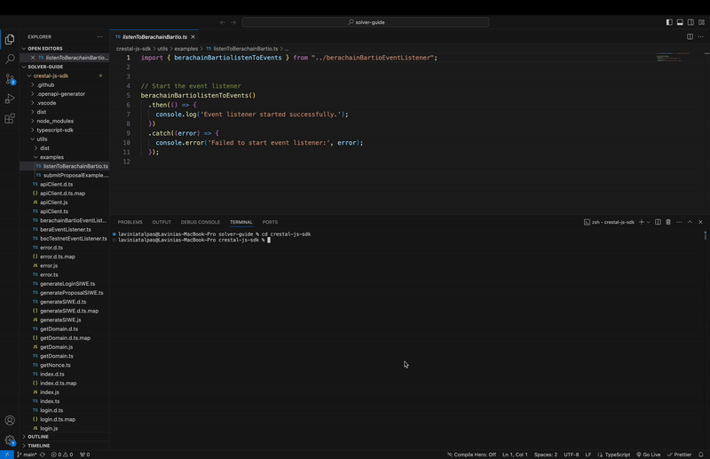
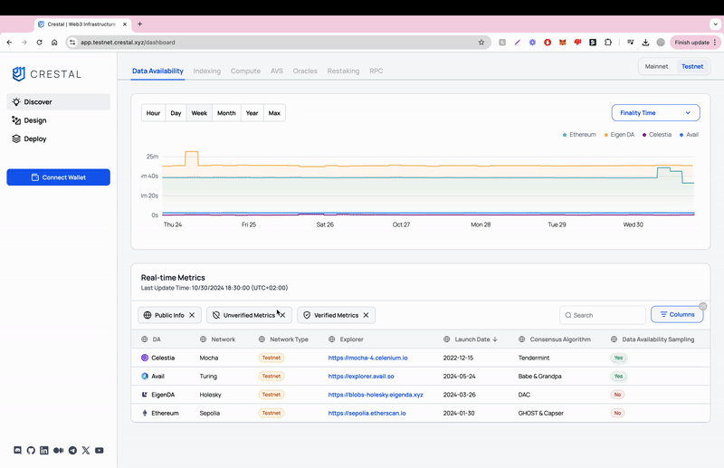
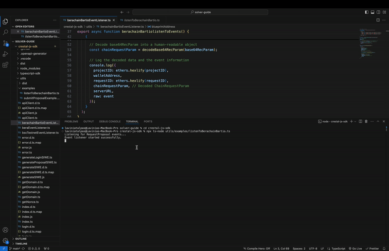
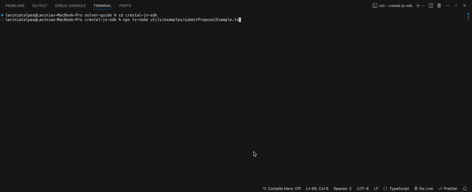
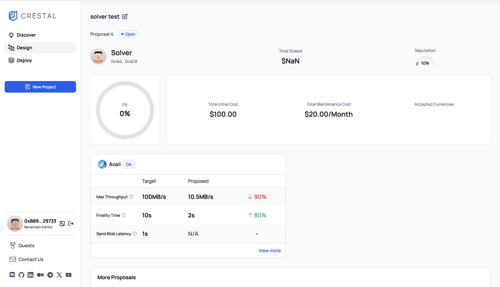

We provide example code in the SDK to help you quickly test the solver integration flow. You'll find two key examples in the `utils/examples` directory:

- `listenToBerachainBartio`: Demonstrates how to listen for proposal requests on Berachain bArtio testnet.
- `submitProposalExample`: Shows how to submit a proposal with dummy data.


## Step 1: Clone the CrestalJS SDK repository

```bash
# Clone the SDK
git clone https://github.com/crestalnetwork/crestal-js-sdk.git

# Install and build
cd crestal-js-sdk
npm install # or yarn
npm run build # or yarn build
```


## Step 2: Start the Event listener

This will start listening for proposal requests on the Berachain bArtio testnet.
When a request is detected, you'll see the request details in your console.

```bash
# From the crestal-js-sdk directory
npx ts-node utils/examples/listenToBerachainBartio.ts
```



## Step 3: Trigger a Request Proposal

Now, let's trigger a `RequestProposal` event so the event listener can detect it, in order for us 
to get the data needed for making a proposal.

1. Leave the listener running
2. [Add](/networks/supported-networks#adding-to-wallet-via-chainlist-2) Berachain bArtio Tesnet to your wallet
3. Make sure you have some Berachain bArtio Tesnet tokens on your account.
More details on how to get them [here](/networks/supported-networks#faucet-options-2).
4. Open the [Crestal dApp](https://app.testnet.crestal.xyz/dashboard) and connect your wallet to it.
5. Start a new project.



6. Use the AI Assistant to generate a proposal request, and submit it. The submitted proposal request will show up
in the event listener output.




Event Listener Output (Sensitive Data Masked):

```bash
Listening for RequestProposal events...
Event listener started successfully.
RequestProposal Event Detected
{
  projectID: '0x474595b51a7ab07b3745193c91f2c0708b0b26095a660b82d3******d3c64868',
  walletAddress: '0xBB900BbE1A20dA4d474666B79a5fa6CE12629733',
  requestID: '0x57de6a6bd64d3423ee07c73f6f08479b**********abead57f0f7ad3d66fcae',
  chainRequestParam: {
    project_id: '0x474595b51a7ab07b3745193c91f2c0708b0b26095a660b82d3******d3c64868',
    types: [ 'DA' ],
    cost_per_mb: 0.1,
    max_throughput: 100,
    number_of_nodes: 100,
    send_blob_latency: 1,
    finality_time: 10,
    latency: 0,
    block_time: 0,
    first_category: 'Layer 2',
    second_category: 'General'
  },
  serverURL: 'https://api.service.testnet.crestal.xyz',
  raw: ContractEventPayload {
    filter: 'RequestProposal',
    emitter: Contract {
      target: '0x5D8d432C96DcEE25c9B3B72634B20f11AA5516d7',
      interface: [Interface],
      runner: JsonRpcProvider {},
      filters: {},
      fallback: null,
      [Symbol(_ethersInternal_contract)]: {}
    },
    log: EventLog {
      provider: JsonRpcProvider {},
      transactionHash: '0xdf0bdaf657f5f25ded42ff3f7061915********4255648e9db8f7b184f308bc8',
      blockHash: '0x52958efaebf687be7303862182f735d8456c4b903655b2d277d507a75c2a9c00',
      blockNumber: 6245816,
      removed: false,
      address: '0x5D8d432C96DcEE25c9B3B72634B20f11AA5516d7',
      data: '0x000000000000000000000000bb900bbe1a20da4d474666***********62973300000000000000000000000000000000000000000000000000000000000000060000000000000000000000000000000000000000000000000000000000000020000000000000000000000000000000000000000000000000000000000000017865794a77636d39715a574e3058326c6b496a6f694d4867304e7a51314f5456694e5446684e3246694d4464694d7a63304e5445354d324d354d575979597a41334d4468694d4749794e6a41354e5745324e6a42694f444a6b4d7a59344f444d7a5a6d517a597a59304f4459344969776964486c775a584d694f6c736952454569585377695932397a644639775a584a66625749694f6a41754d537769625746345833526f636d39315a326877645851694f6a45774d437769626e5674596d56795832396d583235765a47567a496a6f784d444173496e4e6c626d5266596d7876596c39735958526c626d4e35496a6f784c434a6d6157356862476c30655639306157316c496a6f784d437769624746305a57356a655349364d437769596d78765932746664476c745a5349364d4377695a6d6c7963335266593246305a576476636e6b694f694a4d59586c6c63694179496977696332566a6232356b58324e686447566e62334a35496a6f69523256755a584a6862434a390000000000000000000000000000000000000000000000000000000000000000000000000000002768747470733a2f2f6170692e736572766963652e746573746e65742e6372657374616c2e78797a00000000000000000000000000000000000000000000000000',
      topics: [Array],
      index: 442,
      transactionIndex: 44,
      interface: [Interface],
      fragment: [EventFragment],
      args: [Result]
    },
    args: Result(5) [
      '0x474595b51a7ab07b3745193c91f2c0708b0b26095a660b82d368833fd3c64868',
      '0xBB900BbE1A20dA4d474666B7********CE12629733',
      '0x57de6a6bd64d3423ee07c73f6f08479b**********abead57f0f7ad3d66fcae',
      'eyJwcm9qZWN0X2lkIjoiMHg0NzQ1OTViNTFhN2FiMDdiMzc0NTE5M2M5MWYyYzA3MDhiMGIyNjA5NWE2NjBiODJkMzY4ODMzZmQzYzY0ODY4IiwidHlwZXMiOlsiREEiXSwiY29zdF9wZXJfbWIiOjAuMSwibWF4X3Rocm91Z2hwdXQiOjEwMCwibnVtYmVyX29mX25vZGVzIjoxMDAsInNlbmRfYmxvYl9sYXRlbmN5IjoxLCJmaW5hbGl0eV90aW1lIjoxMCwibGF0ZW5jeSI6MCwiYmxvY2tfdGltZSI6MCwiZmlyc3RfY2F0ZWdvcnkiOiJMYXllciAyIiwic2Vjb25kX2NhdGVnb3J5IjoiR2VuZXJhbCJ9',
      'https://api.service.testnet.crestal.xyz'
    ],
    fragment: EventFragment {
      type: 'event',
      inputs: [Array],
      name: 'RequestProposal',
      anonymous: false
    }
  }
}
```

## Step 4: Fill in the details in [`submitProposalExample`](https://github.com/crestalnetwork/crestal-js-sdk/blob/main/utils/examples/submitProposalExample.ts)

Navigate to `utils/examples/submitProposalExample`. Fill in the required fields with your own details:
- `const solverAddress = 'YOUR_ADDRESS'`: Your account address as a solver(not recommended to use 
the same one as the one at step 3). 
- `project_id: "PROJECT_ID_FROM_REQUEST"`: The project id from the event listener output (the detected proposal request).
- `request_id: "REQUEST_ID_FROM_REQUEST"`: The request id from the event listener output (the detected proposal request).
- `const privateKey = "YOUR_ADDRESS_PRIVATE_KEY"` the prviate key for the `solverAddress`.

<Accordion title="Filled in Details Example (Sensitive Data Masked)">

```typescript
import { generateProposalSIWE } from "../generateProposalSIWE";
import { signMessageWithPrivateKey } from "../signMessage";
import { submitProposal } from "../submitProposal";


async function main() {
  const solverAddress = '0x1e22A1C3AB5DfbA41d61d546f39b08A43410caC8';
  const chainId = 80084; // Berachain bArtio testnet chain id
  const postSolverProposal = {
    project_id: "0x474595b51a7ab07b3745193c91f2c0708b0b26095a660b82d3******d3c64868",
    request_id: "0x57de6a6bd64d3423ee07c73f6f08479b**********abead57f0f7ad3d66fcae",
    //Dummy values for these parameters
    target_performance: 10,
    solver_address: solverAddress,
    proposals: [
      {
        fit: 0.9,
        rank: 1,
        type: "public",
        da: {
          chain_id: 80084,
          da_name: "Avail",
          network_type: "Testnet",
          gas_token: "ETH",
          avg_cost: 3.2,
          max_throughput: 10.5,
          latency: 0.3,
          finality_time: 2.0,
          geo_coverage: 8,
          grants_available: false,
          number_of_projects: 1,
          uptime: 10,
          block_time: 10,
          total_transactions: 1000000002,
          total_blocks: 1000000003,
          number_of_nodes: 5000,
          cost_per_transaction: 0.3,
          cost_per_mb: 0.2,
          error_rate: 0.02,
          init_cost: 100,
          maintenance_cost: 20
        }
      }
    ]
  };
  
  // Generate the SIWE message and signature
  try {
    const siweMessage = await generateProposalSIWE(postSolverProposal, solverAddress, chainId);
    
    if (siweMessage) {
      const privateKey = "469f21a9bf88257a595177*****************3a8fbf15ca1d3a0";
      const signature = await signMessageWithPrivateKey(siweMessage, privateKey);
      
  

      // Submit the proposal using the generated SIWE message and signature
      const response = await submitProposal(solverAddress, siweMessage, signature);
      console.log("response:", response);


    } else {
      console.log('Failed to generate SIWE message.');
    }
  } catch (error) {
    console.error('An error occurred:', error);
  }
}

// Run the main function
main();
```

</Accordion>

## Step 5: Submit the Proposal

After filling in the details, submit the proposal to the Crestal backend:

```bash
npx ts-node utils/examples/submitProposalExample.ts
```



The output looks like this:

```bash
laviniatalpas@Lavinias-MacBook-Pro crestal-js-sdk % npx ts-node utils/examples/submitProposalExample.ts
Full Response: {
  "proposals": [
    {
      "solverAddress": "0x1e22A1C3AB5DfbA41d61d546f39b08A43410caC8",
      "da": {
        "initCost": 100,
        "maintenanceCost": 20,
        "errorRate": 0.02
      },
      "indexing": {},
      "compute": {},
      "storage": {}
    }
  ],
  "solverAddress": "0x1e22A1C3AB5DfbA41d61d546f39b08A43410caC8",
  "requestId": "0x57de6a6bd64d3423ee07c73f6f08479bb5ac5ed1cdfab**********d3d66fcae"
}
DA Proposal Details: {
  "initCost": 100,
  "maintenanceCost": 20,
  "errorRate": 0.02
}
```
After the proposal is submitted, it shows up on the Crestal dapp, in the list of proposals:



With these steps, you can explore and test the DA solver integration flow on Crestal, gaining a practical understanding of 
the setup and proposal submission process. Once you’re comfortable, you’ll be ready to adapt these concepts for a full integration in a production environment.

