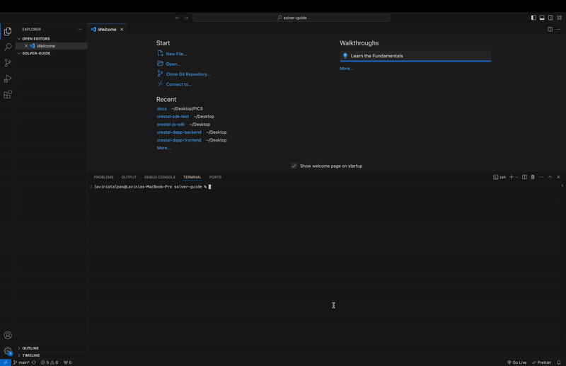
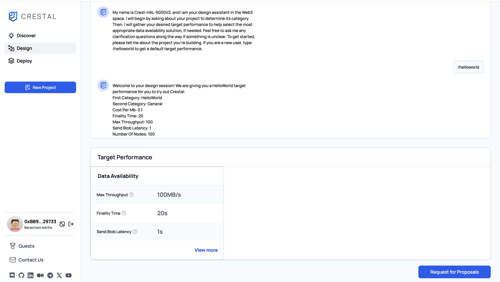
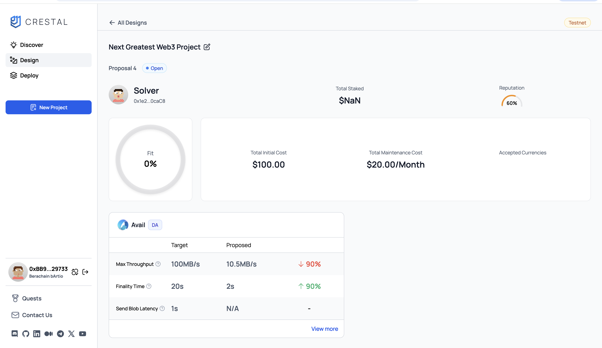
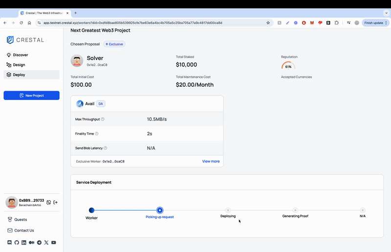
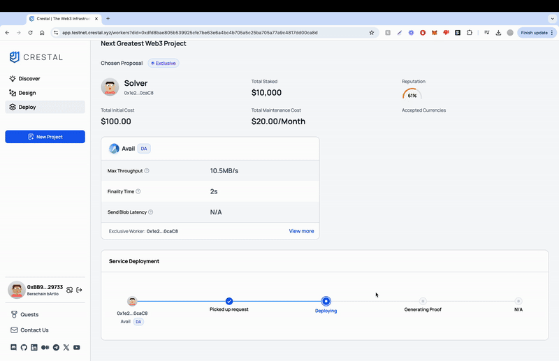
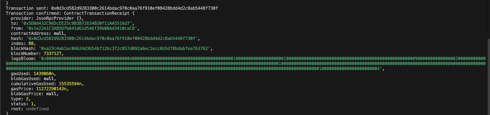
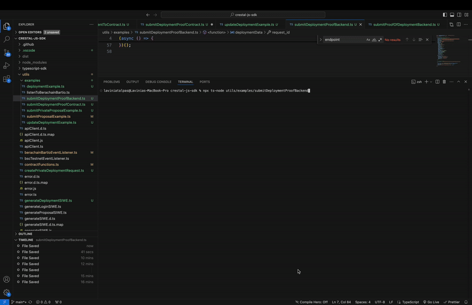

## Prerequisites: Clone the CrestalJS SDK repository

```bash
# Clone the SDK
git clone https://github.com/crestalnetwork/crestal-js-sdk.git

# Install and build
cd crestal-js-sdk
npm install # or yarn
npm run build # or yarn build
```



## 1. **Create a New Project**

1. Visit the [Crestal Dashboard](https://app.testnet.crestal.xyz/dashboard).
2. Select **New Project**.
3. For testing purposes, type `/helloworld` into the AI assistant. The assistant will generate a **HelloWorld** target performance for you to try Crestal.



---

## 2. **Run the Event Listener**

Run the event listener for your desired network. In this example, we use **Berachain**.

<Info>
Listeners are available for all supported networks:
- [Listener for Berachain bArtio Testnet]()
- [Listener for Polygon Amoy Testnet]()
- [Listener for BSC Testnet]()
</Info>

### Running the Listener
```bash
npx ts-node utils/examples/listenToBerachainBartio.ts
```


### Expected Output Example

When you run the event listener, it listens for incoming `RequestProposal` events on the specified network. These events contain detailed information about the proposal request, including the `projectID`, `requestID`, and parameters like `chainRequestParam` that describe the required data availability (DA) configuration.

```bash
laviniatalpas@Lavinias-MacBook-Pro crestal-js-sdk % npx ts-node utils/examples/listenToBerachainBartio.ts
Listening for all events...
Event listener started successfully.
laviniatalpas@Lavinias-MacBook-Pro crestal-js-sdk % npx ts-node utils/examples/listenToBerachainBartio.ts
Listening for all events...
Event listener started successfully.
RequestProposal Event Detected
{
  projectID: '0xeed9af033fecec172ba5d55687960413e9c199177d26440f0b9e8d65b0c480cd',
  walletAddress: '0xBB900BbE1A20dA4d474666B79a5fa6CE12629733',
  requestID: '0x7baa4f655fb2571f24be3bb7a096d406de03deb87fd62b1de9b68077a1a7e076',
  chainRequestParam: {
    project_id: '0xeed9af033fecec172ba5d55687960413e9c199177d26440f0b9e8d65b0c480cd',
    types: [ 'DA' ],
    cost_per_mb: 0.1,
    max_throughput: 100,
    number_of_nodes: 100,
    send_blob_latency: 1,
    finality_time: 20,
    latency: 0,
    block_time: 0,
    first_category: 'HelloWorld',
    second_category: 'General'
  },
  serverURL: 'https://api.service.testnet.crestal.xyz',
  raw: ContractEventPayload {
    filter: 'RequestProposal',
    emitter: Contract {
      target: '0x5D8d432C96DcEE25c9B3B72634B20f11AA5516d7',
      interface: [Interface],
      runner: JsonRpcProvider {},
      filters: {},
      fallback: null,
      [Symbol(_ethersInternal_contract)]: {}
    },
    log: EventLog {
      provider: JsonRpcProvider {},
      transactionHash: '0x8c41c324cdc7b351b06e765bc473732f9d8b1b56b3623c5d165250de135cbe76',
      blockHash: '0x6ddfb049c654db7082035392f1c1d719ed2f3495c68e3d569268bb8b947e7bfb',
      blockNumber: 7127935,
      removed: false,
      address: '0x5D8d432C96DcEE25c9B3B72634B20f11AA5516d7',
      data: '0x000000000000000000000000bb900bbe1a20da4d474666b79a5fa6ce1262973300000000000000000000000000000000000000000000000000000000000000600000000000000000000000000000000000000000000000000000000000000200000000000000000000000000000000000000000000000000000000000000017c65794a77636d39715a574e3058326c6b496a6f694d48686c5a575135595759774d7a4e6d5a574e6c597a45334d6d4a684e5751314e5459344e7a6b324d4451784d325535597a45354f5445334e3251794e6a51304d475977596a6c6c4f4751324e574977597a51344d474e6b4969776964486c775a584d694f6c736952454569585377695932397a644639775a584a66625749694f6a41754d537769625746345833526f636d39315a326877645851694f6a45774d437769626e5674596d56795832396d583235765a47567a496a6f784d444173496e4e6c626d5266596d7876596c39735958526c626d4e35496a6f784c434a6d6157356862476c30655639306157316c496a6f794d437769624746305a57356a655349364d437769596d78765932746664476c745a5349364d4377695a6d6c7963335266593246305a576476636e6b694f694a495a57787362316476636d786b496977696332566a6232356b58324e686447566e62334a35496a6f69523256755a584a6862434a3900000000000000000000000000000000000000000000000000000000000000000000002768747470733a2f2f6170692e736572766963652e746573746e65742e6372657374616c2e78797a00000000000000000000000000000000000000000000000000',
      topics: [Array],
      index: 262,
      transactionIndex: 10,
      interface: [Interface],
      fragment: [EventFragment],
      args: [Result]
    },
    args: Result(5) [
      '0xeed9af033fecec172ba5d55687960413e9c199177d26440f0b9e8d65b0c480cd',
      '0xBB900BbE1A20dA4d474666B79a5fa6CE12629733',
      '0x7baa4f655fb2571f24be3bb7a096d406de03deb87fd62b1de9b68077a1a7e076',
      'eyJwcm9qZWN0X2lkIjoiMHhlZWQ5YWYwMzNmZWNlYzE3MmJhNWQ1NTY4Nzk2MDQxM2U5YzE5OTE3N2QyNjQ0MGYwYjllOGQ2NWIwYzQ4MGNkIiwidHlwZXMiOlsiREEiXSwiY29zdF9wZXJfbWIiOjAuMSwibWF4X3Rocm91Z2hwdXQiOjEwMCwibnVtYmVyX29mX25vZGVzIjoxMDAsInNlbmRfYmxvYl9sYXRlbmN5IjoxLCJmaW5hbGl0eV90aW1lIjoyMCwibGF0ZW5jeSI6MCwiYmxvY2tfdGltZSI6MCwiZmlyc3RfY2F0ZWdvcnkiOiJIZWxsb1dvcmxkIiwic2Vjb25kX2NhdGVnb3J5IjoiR2VuZXJhbCJ9',
      'https://api.service.testnet.crestal.xyz'
    ],
    fragment: EventFragment {
      type: 'event',
      inputs: [Array],
      name: 'RequestProposal',
      anonymous: false
    }
  }
}
```

---

## 3. **Submit a Proposal**

The `chainRequestParam` field in the `RequestProposal` event provides all the necessary information required to craft and submit a proposal. 
The proposal we are sending now for test purposes doesn’t have to match the request exactly, as they are dummy values, but it must conform to the required format. 
For detailed guidance about proposals, refer to the [Solver Integration Walkthrough](https://docs.crestal.xyz/solvers/solver-integration-quick-guide).

We are going to submit a proposal with private worker, this means that we mention a specific worker that will be the only one who can
make the deployment. To do this, we'll use `utils/examples/submitPrivateProposalExample.ts`.

**Populate Required Variables:**

- `solver_address`: Your account address as a solver.
- `project_id`: Use the `project_id` from the event listener output.
- `request_id`: Use the `request_id` from the event listener output.
- `privateKey`: The private key for the `solver_address`.
- `worker_address`: The address of the worker handling the deployment. This can be the same as the solver address.


Use the following command to run the script and submit the proposal:

`npx ts-node utils/examples/submitPrivateProposalExample.ts`

Once submitted, the proposal will appear on the Crestal frontend.




Here’s an example proposal data with populated data:
```json
{
  "project_id": "0x2835c205f8f558febf22804eb****************1dce1ff558b21ad094f13b7",
  "request_id": "0xa6f52234e6c993***********************************d35ecaa25f97c05",
  "target_performance": 10,
  "solver_address": "0x1e22A1C3AB5DfbA41d61d546f39b08A43410caC8",
  "proposals": [
    {
      "fit": 0.9,
      "rank": 1,
      "worker_address": "0x1e22A1C3AB5DfbA41d61d546f39b08A43410caC8",
      "type": "private",
      "da": {
        "chain_id": 80084,
        "da_name": "Avail",
        "network_type": "Testnet",
        "gas_token": "ETH",
        "avg_cost": 3.2,
        "max_throughput": 10.5,
        "latency": 0.3,
        "finality_time": 2.0,
        "geo_coverage": 8,
        "grants_available": false,
        "number_of_projects": 1,
        "uptime": 10,
        "block_time": 10,
        "total_transactions": 1000000002,
        "total_blocks": 1000000003,
        "number_of_nodes": 5000,
        "cost_per_transaction": 0.3,
        "cost_per_mb": 0.2,
        "error_rate": 0.02,
        "init_cost": 100,
        "maintenance_cost": 20
      }
    }
  ]
}
```

---

## 4. **Approve the Proposal for Deployment**

1. Approve the proposal from the frontend.
2. Ensure the event listener is running to detect the following events:
    - **AcceptDeployment**
    - **RequestPrivateDeployment**


### Example Output
```bash
Event listener started successfully.
AcceptDeployment Event Detected
{
  projectID: '0xeed9af033fecec172ba5d55687960413e9c199177d26440f0b9e8d65b0c480cd',
  requestID: '0x214a4cd565bc7a806781dd047ba96d5afa7f33aa545f13f1aeedee1872139c3a',
  workerAddress: '0x1e22A1C3AB5DfbA41d61d546f39b08A43410caC8',
  raw: ContractEventPayload {
    filter: 'AcceptDeployment',
    emitter: Contract {
      target: '0x5D8d432C96DcEE25c9B3B72634B20f11AA5516d7',
      interface: [Interface],
      runner: JsonRpcProvider {},
      filters: {},
      fallback: null,
      [Symbol(_ethersInternal_contract)]: {}
    },
    log: EventLog {
      provider: JsonRpcProvider {},
      transactionHash: '0x79115afa6129c9d0a51561b01a1aa30a80b84f1f5d5b4c352c4ae76197d7e796',
      blockHash: '0x89fc7d295d3cf95ef2e73e77579a82e2c2eedf8d7b306c9ff8cea2d8936770df',
      blockNumber: 7128001,
      removed: false,
      address: '0x5D8d432C96DcEE25c9B3B72634B20f11AA5516d7',
      data: '0x',
      topics: [Array],
      index: 349,
      transactionIndex: 33,
      interface: [Interface],
      fragment: [EventFragment],
      args: [Result]
    },
    args: Result(3) [
      '0xeed9af033fecec172ba5d55687960413e9c199177d26440f0b9e8d65b0c480cd',
      '0x214a4cd565bc7a806781dd047ba96d5afa7f33aa545f13f1aeedee1872139c3a',
      '0x1e22A1C3AB5DfbA41d61d546f39b08A43410caC8'
    ],
    fragment: EventFragment {
      type: 'event',
      inputs: [Array],
      name: 'AcceptDeployment',
      anonymous: false
    }
  }
}
RequestPrivateDeployment Event Detected
{
  projectID: '0xeed9af033fecec172ba5d55687960413e9c199177d26440f0b9e8d65b0c480cd',
  walletAddress: '0xBB900BbE1A20dA4d474666B79a5fa6CE12629733',
  privateWorkerAddress: '0x1e22A1C3AB5DfbA41d61d546f39b08A43410caC8',
  solverAddress: '0x1e22A1C3AB5DfbA41d61d546f39b08A43410caC8',
  requestID: '0x214a4cd565bc7a806781dd047ba96d5afa7f33aa545f13f1aeedee1872139c3a',
  decodedProposal: {
    id: 28049,
    da_name: 'Avail',
    chain_id: 80084,
    project_id: '0xeed9af033fecec172ba5d55687960413e9c199177d26440f0b9e8d65b0c480cd',
    network_type: 'Testnet',
    gas_token: 'ETH',
    avg_cost: 3.2,
    max_throughput: 10.5,
    finality_time: 2,
    geo_coverage: 8,
    number_of_projects: 1,
    uptime: 10,
    block_time: 10,
    total_transactions: 1000000002,
    total_blocks: 1000000003,
    number_of_nodes: 5000,
    cost_per_transaction: 0.3,
    cost_per_mb: 0.2,
    error_rate: 0.02,
    init_cost: 100,
    maintenance_cost: 20,
    worker_address: '0x1e22A1C3AB5DfbA41d61d546f39b08A43410caC8',
    type: 'DA',
    created_at: '2024-11-20T22:31:51.471797Z'
  },
  serverURL: 'https://api.service.testnet.crestal.xyz',
  raw: ContractEventPayload {
    filter: 'RequestPrivateDeployment',
    emitter: Contract {
      target: '0x5D8d432C96DcEE25c9B3B72634B20f11AA5516d7',
      interface: [Interface],
      runner: JsonRpcProvider {},
      filters: {},
      fallback: null,
      [Symbol(_ethersInternal_contract)]: {}
    },
    log: EventLog {
      provider: JsonRpcProvider {},
      transactionHash: '0x79115afa6129c9d0a51561b01a1aa30a80b84f1f5d5b4c352c4ae76197d7e796',
      blockHash: '0x89fc7d295d3cf95ef2e73e77579a82e2c2eedf8d7b306c9ff8cea2d8936770df',
      blockNumber: 7128001,
      removed: false,
      address: '0x5D8d432C96DcEE25c9B3B72634B20f11AA5516d7',
      data: '0x000000000000000000000000bb900bbe1a20da4d474666b79a5fa6ce126297330000000000000000000000001e22a1c3ab5dfba41d61d546f39b08a43410cac80000000000000000000000001e22a1c3ab5dfba41d61d546f39b08a43410cac800000000000000000000000000000000000000000000000000000000000000a000000000000000000000000000000000000000000000000000000000000003e0000000000000000000000000000000000000000000000000000000000000031865794a705a4349364d6a67774e446b73496d526858323568625755694f694a42646d467062434973496d4e6f59576c7558326c6b496a6f344d4441344e43776963484a76616d566a644639705a434936496a42345a57566b4f57466d4d444d7a5a6d566a5a574d784e7a4a695954566b4e5455324f4463354e6a41304d544e6c4f574d784f546b784e7a646b4d6a59304e44426d4d4749355a54686b4e6a56694d474d304f44426a5a434973496d356c64486476636d746664486c775a534936496c526c633352755a5851694c434a6e59584e66644739725a5734694f694a46564567694c434a68646d64665932397a644349364d7934794c434a7459586866644768796233566e61484231644349364d5441754e5377695a6d6c755957787064486c6664476c745a5349364d6977695a32567658324e76646d56795957646c496a6f344c434a75645731695a584a6662325a6663484a76616d566a64484d694f6a4573496e567764476c745a5349364d544173496d4a7362324e7258335270625755694f6a45774c434a306233526862463930636d46756332466a64476c76626e4d694f6a45774d4441774d4441774d444973496e52766447467358324a7362324e72637949364d5441774d4441774d4441774d797769626e5674596d56795832396d583235765a47567a496a6f314d4441774c434a6a62334e305833426c636c3930636d46756332466a64476c76626949364d43347a4c434a6a62334e305833426c636c3974596949364d4334794c434a6c636e4a76636c39795958526c496a6f774c6a41794c434a70626d6c3058324e76633351694f6a45774d43776962574670626e526c626d4675593256665932397a644349364d6a4173496e6476636d746c636c39685a4752795a584e7a496a6f694d4867785a544979515446444d3046434e55526d596b45304d5751324d5751314e445a6d4d7a6c694d4468424e444d304d54426a59554d344969776964486c775a534936496b52424969776959334a6c5958526c5a46396864434936496a49774d6a51744d5445744d6a42554d6a49364d7a45364e5445754e4463784e7a6b3357694a390000000000000000000000000000000000000000000000000000000000000000000000000000002768747470733a2f2f6170692e736572766963652e746573746e65742e6372657374616c2e78797a00000000000000000000000000000000000000000000000000',
      topics: [Array],
      index: 348,
      transactionIndex: 33,
      interface: [Interface],
      fragment: [EventFragment],
      args: [Result]
    },
    args: Result(7) [
      '0xeed9af033fecec172ba5d55687960413e9c199177d26440f0b9e8d65b0c480cd',
      '0xBB900BbE1A20dA4d474666B79a5fa6CE12629733',
      '0x1e22A1C3AB5DfbA41d61d546f39b08A43410caC8',
      '0x1e22A1C3AB5DfbA41d61d546f39b08A43410caC8',
      '0x214a4cd565bc7a806781dd047ba96d5afa7f33aa545f13f1aeedee1872139c3a',
      'eyJpZCI6MjgwNDksImRhX25hbWUiOiJBdmFpbCIsImNoYWluX2lkIjo4MDA4NCwicHJvamVjdF9pZCI6IjB4ZWVkOWFmMDMzZmVjZWMxNzJiYTVkNTU2ODc5NjA0MTNlOWMxOTkxNzdkMjY0NDBmMGI5ZThkNjViMGM0ODBjZCIsIm5ldHdvcmtfdHlwZSI6IlRlc3RuZXQiLCJnYXNfdG9rZW4iOiJFVEgiLCJhdmdfY29zdCI6My4yLCJtYXhfdGhyb3VnaHB1dCI6MTAuNSwiZmluYWxpdHlfdGltZSI6MiwiZ2VvX2NvdmVyYWdlIjo4LCJudW1iZXJfb2ZfcHJvamVjdHMiOjEsInVwdGltZSI6MTAsImJsb2NrX3RpbWUiOjEwLCJ0b3RhbF90cmFuc2FjdGlvbnMiOjEwMDAwMDAwMDIsInRvdGFsX2Jsb2NrcyI6MTAwMDAwMDAwMywibnVtYmVyX29mX25vZGVzIjo1MDAwLCJjb3N0X3Blcl90cmFuc2FjdGlvbiI6MC4zLCJjb3N0X3Blcl9tYiI6MC4yLCJlcnJvcl9yYXRlIjowLjAyLCJpbml0X2Nvc3QiOjEwMCwibWFpbnRlbmFuY2VfY29zdCI6MjAsIndvcmtlcl9hZGRyZXNzIjoiMHgxZTIyQTFDM0FCNURmYkE0MWQ2MWQ1NDZmMzliMDhBNDM0MTBjYUM4IiwidHlwZSI6IkRBIiwiY3JlYXRlZF9hdCI6IjIwMjQtMTEtMjBUMjI6MzE6NTEuNDcxNzk3WiJ9',
      'https://api.service.testnet.crestal.xyz'
    ],
    fragment: EventFragment {
      type: 'event',
      inputs: [Array],
      name: 'RequestPrivateDeployment',
      anonymous: false
    }
  }
}
```

---

## 5. **Submit the Deployment Request to Backend**

The deployment request must be submitted to both the backend and the smart contract. For **private proposals** with a **private worker**, the request only needs to be submitted to the backend.

### Deployment Data
The **`Deployment`** type represents the data structure required for submitting deployment requests.
It also contains the proposal itself. The deployment details are also included in this type, but they are only
required when submitting the proof of deployment.

The `requestId` and `projectId` can be extracted from the `RequestPrivateDeployment` event.

```typescript
const deploymentData: Deployment = {
  request_id: requestId,
  project_id: projectId,
  chain_id: chainId,
  worker_address: workerAddress,
  solver_address: workerAddress,
  status: 'deploying',
  proposal: proposal
};
```

<Accordion title="Full Deployment Type">

```typescript
export interface Deployment {
    request_id: string; // Required field, unique ID for the deployment request
    chain_id: number;
    project_id?: string; // Optional field, project ID from the Crestal website
    worker_name?: string; // Optional field, name of the worker
    worker_address: string; // Required field, worker's Ethereum address in hex format
    solver_address: string; // Required field, solver's Ethereum address in hex format
    status: DeployStatus; // Required field, current status of the deployment
    proposal_hash?: string; // Optional field, hash of the proposal
    proposal?: object; // Optional field, serialized JSON string of the proposal
    deployment_details?: DeploymentDetails ; // Optional field, serialized JSON string of the deployment details
    }
```

</Accordion>

Deployment Status Types:
- `init`
- `pick_up`
- `deploying`
- `deployed`
- `generating_proof`
- `generated_proof`


### Proposal Data

For testing purposes, the predefined proposal from the SDK example we are using looks like this:

```javascript
const proposal = {
  chain_id: chainId,
  da_name: "Avail",
  network_type: "Testnet",
  gas_token: "ETH",
  avg_cost: 3.2,
  max_throughput: 10.5,
  latency: 0.3,
  finality_time: 2.0,
  geo_coverage: 8,
  grants_available: false,
  number_of_projects: 1,
  uptime: 10,
  block_time: 10,
  total_transactions: 1000000002,
  total_blocks: 1000000003,
  number_of_nodes: 5000,
  cost_per_transaction: 0.3,
  cost_per_mb: 0.2,
  error_rate: 0.02,
  init_cost: 100,
  maintenance_cost: 20
};
```

However, in a real-world scenario, the actual data for the proposal can be extracted from the `RequestPrivateDeployment` event's `decodedProposal` field. Here's an example:

```bash
decodedProposal: {
    id: 28049,
    da_name: 'Avail',
    chain_id: 80084,
    project_id: '0xeed9af033fecec172ba5d55687960413e9c199177d26440f0b9e8d65b0c480cd',
    network_type: 'Testnet',
    gas_token: 'ETH',
    avg_cost: 3.2,
    max_throughput: 10.5,
    finality_time: 2,
    geo_coverage: 8,
    number_of_projects: 1,
    uptime: 10,
    block_time: 10,
    total_transactions: 1000000002,
    total_blocks: 1000000003,
    number_of_nodes: 5000,
    cost_per_transaction: 0.3,
    cost_per_mb: 0.2,
    error_rate: 0.02,
    init_cost: 100,
    maintenance_cost: 20,
    worker_address: '0x1e22A1C3AB5DfbA41d61d546f39b08A43410caC8',
    type: 'DA',
    created_at: '2024-11-20T22:31:51.471797Z'
  }
  ```

This proposal is included in the `proposal` field from `Deployment`.

### Submission

For this example, we are using the `utils/examples/submitDeploymentExample` script. 

To submit the deployment request, populate the following fields:

- `workerAddress`: The address of the worker you want to use for deployment.
- `privateKey`: The private key associated with your worker’s address.
- `requestId`: The request ID from the `RequestPrivateDeployment` event.
- `projectId`: The project ID from the `RequestPrivateDeployment` event.

Then run the script:

`npx ts-node utils/examples/submitDeploymentExample.ts`



## 6. **Update the Deployment Status**

The deployment status needs can be updated by submitting requests to the backend.
To achieve this, you can use the `utils/examples/updateDeploymentExample` script.

### Updating the Status to `deployed`

Use the same **`projectId`** and **`requestId`** from Step 5. In the example, the status is set to **`deployed`**, indicating that the deployment has been successfully completed.

<Info>
For the full list of possible statuses please check Step 5.
</Info>

The run the command:

`npx ts-node utils/examples/updateDeploymentExample.ts`

### Frontend Status Progression

After the status is updated to **`deployed`**, the frontend will automatically update the status to **Generating Proof**. This signifies that the deployment is complete and now awaits the submission of the **Proof of Deployment**.



## 8. **Submit the Proof of Deployment**

After completing the deployment, the next step is to submit the Proof of Deployment to both the backend and the blueprint smart contract. 

### Submitting to the Smart Contract

To submit to the smart contract, use the example from `utils/examples/submitDeploymentProofContract.ts`.
The format that needs to be submitted is of type `ProofOfDeploymentContract`. 

<Accordion title="Full ProofOfDeploymentContract Type">

```typescript
export type ProofOfDeploymentContract = {
  request_id: string;
  proposal_base64: string;
  expiration_date: number;
  worker_address: string;
  server_https_url?: string;
  server_http_url?: string;
  server_web_socket_url?: string;
  server_rpc_endpoint?: string;
  server_grpc_endpoint?: string;
  deployment_pick_up_time: number;
  deployment_deployed_time: number;
  description?: string;
  machine_info?: MachineInfo;
  service_info?: ServiceInfo;
};

export type MachineInfo = {
  mac_address: string;
  cloud_provider: string;
  unique_id: string;
};

export type ServiceInfo = {
  api_infos: APIInfo[];
};

export type APIInfo = {
  endpoint: string;
  method: string;
  request?: string;
  response?: string;
};
```
</Accordion>

All this data is already predefined in the example. You just need to populate required variables:

- `projectaId`: Use the `projectId` from Step 6.
- `requestId`: Use the `requestId` from Step 6.
- `workerAddress`: The address of the worker handling the deployment.
- `privateKey`: The private key for the `worker_address`.

Run the script:

` npx ts-node utils/examples/submitDeploymentProofContract.ts`



### Submitting to the Backend

To submit to the backend, we use the update backend endpoint and include the additional fields required for the proof of deployment.

The format is the `Deployment` type from Step 5, and we add the proof of deployment details to the `deployment_details` field as `DeploymentDetails` type.

<Accordion title="Full DeploymentDetails Type">

```typescript
  export type DeploymentDetails = {
    access_url: string;
    server_https_url: string;
    server_http_url: string;
    server_ws_url: string;
    server_wss_url: string;
    server_web_socket_url?: string;
    server_grpc_endpoint?: string;
    server_rpc_endpoint?: string;
    token: string;
  };
```
</Accordion>

All this data is already predefined in the example. You just need to populate required variables:

- `projectId`: Use the `project_id` from Step 6.
- `requestId`: Use the `request_id` from Step 6.
- `workerAddress`: The address of the worker handling the deployment.
- `solverAddress`: The account address as the solver.
- `privateKey`: The private key for the `worker_address`.



---

## 7. **Deployment Completed**

The deployment process is now fully completed. The **Proof of Deployment** has been submitted to both the backend and the smart contract, and all events have been processed successfully. Verify on the frontend that the deployment status reflects the completion, confirming that everything is finalized.

## Quick Commands

```bash
// Step 1: Create a New Project
// Visit Crestal Dashboard and create a new project.
npx ts-node utils/examples/listenToBerachainBartio.ts

// Step 2: Submit Proposal
// Populate solver_address, project_id, request_id, worker_address, and privateKey.
npx ts-node utils/examples/submitPrivateProposalExample.ts

// Step 3: Approve Proposal
// Approve on frontend and ensure event listener detects AcceptDeployment.

// Step 4: Submit Deployment
// Use request_id, project_id, worker_address, and privateKey.
npx ts-node utils/examples/submitDeploymentExample.ts

// Step 5: Update Deployment Status
// Set status to 'deployed'.
npx ts-node utils/examples/updateDeploymentExample.ts

// Step 6: Submit Proof of Deployment
// Smart Contract submission
npx ts-node utils/examples/submitDeploymentProofContract.ts

// Backend submission
npx ts-node utils/examples/submitDeploymentProofBackend.ts

// Final Step: Verify on frontend
// Ensure 'Proof Generated' status is displayed.
```