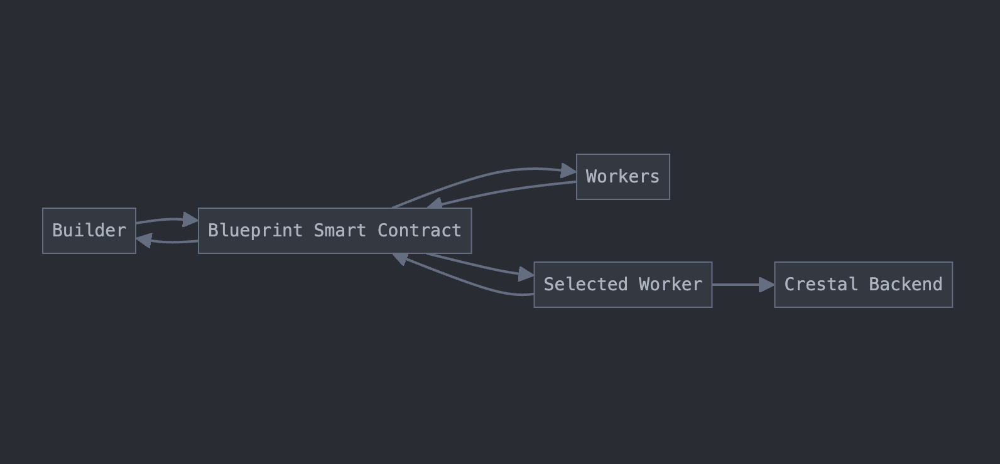
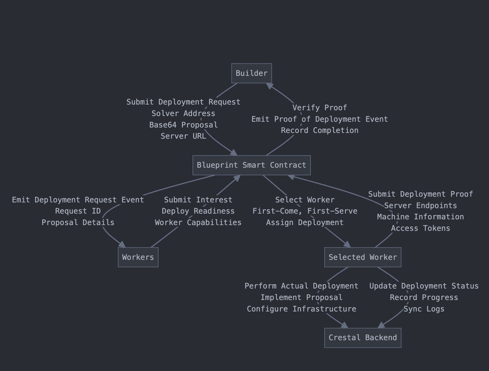

## Roles and Responsibilities

### Builder
- Submits a deployment request to the Blueprint contract.
- Retrieves proof of deployment after the process is completed.

### Worker
- Listens for deployment request events from the Blueprint.
- Submits a deployment request to the blockchain.
- Performs a real deployment based on the proposal.
- Submits a deployment proof to the Blueprint contract.

### Crestal Backend
- Accepts off-chain deployment requests.
- Updates deployment status.

### Blueprint Smart Contract
- Accepts deployment requests from Builders or the Crestal frontend.
- Emits deployment request events.
- Decides which Worker can handle a deployment request.
- Emits events for deployment acceptance and proof of deployment submission.

---

## Deployment Workflow






1. **Builder (via API or Crestal Frontend)** triggers the Blueprint smart contract by requesting a proposal deployment
with the following parameters:
   - `solverAddress`: The address of the Solver. If using the Crestal frontend, this is the address that generated the proposal. Otherwise, it can be any address.
   - `Base64Proposal`: Encoded proposal in Base64 format with additional attributes. Refer to the `proposal.format` chapter for details.
   - `serverURL`: The URL for the Crestal backend (default: Crestal backend URL).

2. **Blueprint Smart Contract** Emits a Deployment Event

    The Blueprint Smart Contract processes deployment requests and emits one of two events depending on the proposal type:

    **RequestDeployment**
    Emitted for general deployment requests. This event includes:
    - **`solverAddress`**: Address of the Solver (or Builder if submitted directly).
    - **`Base64Proposal`**: Encoded proposal details.
    - **`serverURL`**: Backend server URL.
    - **`requestID`**: Unique deployment request ID.

    **RequestPrivateDeployment**
    Emitted for private deployments when the proposal specifies a selected Worker. Includes:
    - **`privateWorkerAddress`**: The explicitly selected Worker’s address.

    These events can be detected by running the event listeners included in the SDK:
    - `utils/berachainBartioEventListener`
    - `utils/bscTestnetEventListener`
    - `utils/polygonAmoyEventListener`

    <Accordion title="Listener Output Example (Sensitive Data Masked)">
    ```bash
    laviniatalpas@Lavinias-MacBook-Pro crestal-js-sdk % npx ts-node utils/examples/listenToBerachainBartio.ts
    Listening for all events...
    Event listener started successfully.
    AcceptDeployment Event Detected
    {
    projectID: '0x888d...360b4f',
    requestID: '0x8d62...305546',
    workerAddress: '0x1e22...10caC8',
    raw: ContractEventPayload {
        filter: 'AcceptDeployment',
        emitter: Contract {
        target: '0x5D8d...5516d7',
        interface: [Interface],
        runner: JsonRpcProvider {},
        filters: {},
        fallback: null,
        [Symbol(_ethersInternal_contract)]: {}
        },
        log: EventLog {
        provider: JsonRpcProvider {},
        transactionHash: '0xc9ea...ef9cb',
        blockHash: '0x9ff6...bd160',
        blockNumber: 6543539,
        removed: false,
        address: '0x5D8d...5516d7',
        data: '0x',
        topics: [Array],
        index: 505,
        transactionIndex: 18,
        interface: [Interface],
        fragment: [EventFragment],
        args: [Result]
        },
        args: Result(3) [
        '0x888d...360b4f',
        '0x8d62...305546',
        '0x1e22...10caC8'
        ],
        fragment: EventFragment {
        type: 'event',
        inputs: [Array],
        name: 'AcceptDeployment',
        anonymous: false
        }
    }
    }
    RequestPrivateDeployment Event Detected
    {
    projectID: '0x888d...360b4f',
    walletAddress: '0x1e22...10caC8',
    privateWorkerAddress: '0x1e22...10caC8',
    solverAddress: '0x1e22...10caC8',
    requestID: '0x8d62...305546',
    decodedProposal: {
        project_id: '0x5f8f...ea4f9b',
        request_id: '0x01e7...dfb385',
        target_performance: 10,
        solver_address: 'solverAddress',
        proposals: [ [Object] ]
    },
    serverURL: 'https://api.service.testnet.crestal.xyz/v1',
    raw: ContractEventPayload {
        filter: 'RequestPrivateDeployment',
        emitter: Contract {
        target: '0x5D8d...5516d7',
        interface: [Interface],
        runner: JsonRpcProvider {},
        filters: {},
        fallback: null,
        [Symbol(_ethersInternal_contract)]: {}
        },
        log: EventLog {
        provider: JsonRpcProvider {},
        transactionHash: '0xc9ea...ef9cb',
        blockHash: '0x9ff6...bd160',
        blockNumber: 6543539,
        removed: false,
        address: '0x5D8d...5516d7',
        data: 'masked',
        topics: [Array],
        index: 504,
        transactionIndex: 18,
        interface: [Interface],
        fragment: [EventFragment],
        args: [Result]
        },
        args: Result(7) [
        '0x888d...360b4f',
        '0x1e22...10caC8',
        '0x1e22...10caC8',
        '0x1e22...10caC8',
        '0x8d62...305546',
        'masked',
        'https://api.service.testnet.crestal.xyz/v1'
        ],
        fragment: EventFragment {
        type: 'event',
        inputs: [Array],
        name: 'RequestPrivateDeployment',
        anonymous: false
        }
    }
    }
    ```
    </Accordion>


3. **Worker submits deployment request** to the contract:
   - Listen for `RequestDeployment` events.
   - Fetch the associated `requestId` from the event.
   - Submit a deployment request to the Blueprint contract using the `submitDeploymentToContract` SDK util from 
   `utils/submitDeploymentToContract`
   - The function takes two parameters, `projectId` and `requestId`, both are extracted from the `RequestDeployment`
   request
   <Info>**This step is skipped for private worker deployments.**</Info>


4. **Blueprint Contract selects worker**:
   - Receives multiple Worker requests.
   - Selects a Worker to handle the deployment using a first-come, first-serve strategy.
   - Emits an `AcceptDeployment` event containing the `requestId` and the selected Worker address.
   <Info>**This step is skipped for private worker deployments.**</Info>

5. **Selected Worker**:
   - Listens for `AcceptDeployment` events to verify if they are assigned.
   - If selected:
     - Performs the real deployment.
     - Sends a POST request to the Crestal backend (`/v1/deployments/worker`) to record the deployment using
     `submitDeployment` from `utils/submitDeployment` following the below format:
        ```typescript
        export interface Deployment {
            request_id: string; // Required field, unique ID for the deployment request
            chain_id: number;
            project_id?: string; // Optional field, project ID from the Crestal website
            worker_name?: string; // Optional field, name of the worker
            worker_address: string; // Required field, worker's Ethereum address in hex format
            solver_address: string; // Required field, solver's Ethereum address in hex format
            status: DeployStatus; // Required field, current status of the deployment
            proposal_hash?: string; // Optional field, hash of the proposal
            proposal?: object; // Optional field, serialized JSON string of the proposal
            deployment_details?: DeploymentDetails ; // Optional field, serialized JSON string of the deployment details
            }
        export type DeployStatus =
            | 'init'
            | 'pick_up'
            | 'deploying'
            | 'deployed'
            | 'generating_proof'
            | 'generated_proof';
            ```
    
     - Syncs deployment status via `/v1/deployments/worker/status` using `updateDeploymentStatus` from 
     `utils/updateDeploymentStatus`.
     - Completes the deployment and submits proof to the Blueprint using `submitDeploymentToContract`
     from `utils/submitDeploymentToContract` following the above format:
        ```typescript
        export type ProofOfDeploymentContract = {
            request_id: string;
            proposal_base64: string;
            expiration_date: number;
            worker_address: string;
            server_https_url?: string;
            server_http_url?: string;
            server_web_socket_url?: string;
            server_rpc_endpoint?: string;
            server_grpc_endpoint?: string;
            deployment_pick_up_time: number;
            deployment_deployed_time: number;
            description?: string;
            machine_info?: MachineInfo;
            service_info?: ServiceInfo;
            };

        export type MachineInfo = {
            mac_address: string;
            cloud_provider: string;
            unique_id: string;
            };

        export type ServiceInfo = {
            api_infos: APIInfo[];
            };

        export type APIInfo = {
            endpoint: string;
            method: string;
            request?: string;
            response?: string;
            };
        ```
     - Syncs the proof of deployment with the Crestal backend via `/v1/deployments/worker/status` using
     `updateDeploymentStatus`, this time including `DeploymentDetails`:
        ```typescript
        export type DeploymentDetails = {
            access_url: string;
            server_https_url: string;
            server_http_url: string;
            server_ws_url: string;
            server_wss_url: string;
            server_web_socket_url?: string;
            server_grpc_endpoint?: string;
            server_rpc_endpoint?: string;
            token: string;
            };
        ```
  
6. **The contract** receives the proof of deployment:
   - Receives the proof of deployment.
   - Emits a `GeneratedProofOfDeployment` event containing the Base64-encoded proof.

---

## Event Details

Events Emitted by the Blueprint Smart Contract
- **`RequestDeployment`**: Signals a new deployment request.
- **`AcceptDeployment`**: Indicates a Worker has been selected for deployment.
- **`GeneratedProofOfDeployment`**: Contains the Base64-encoded proof of deployment.
